# [Kubernetes Tutorial for Beginners](https://www.youtube.com/watch?v=X48VuDVv0do)

# What is a container / what is an image?
Shad: Container as to process as Image as to program.

- https://docs.docker.com/get-started/docker-concepts/the-basics/what-is-a-container/
    - Simply put, containers are isolated processes for each of your app's components. Each component - the frontend React app, the Python API engine, and the database - runs in its own isolated environment, completely isolated from everything else on your machine.
    - A VM is an entire operating system with its own kernel, hardware drivers, programs, and applications. Spinning up a VM only to isolate a single application is a lot of overhead.
    - A container is simply an isolated process with all of the files it needs to run. If you run multiple containers, they all share the same kernel, allowing you to run more applications on less infrastructure.

- https://docs.docker.com/get-started/docker-concepts/the-basics/what-is-an-image/
    - That's where container images come in. A container image is a standardized package that includes all of the files, binaries, libraries, and configurations to run a container. Example: For a Python web app, it'll include the Python runtime, your app code, and all of its dependencies.
        - Images are immutable. Once an image is created, it can't be modified. You can only make a new image or add changes on top of it.
        - Container images are composed of layers. Each layer represents a set of file system changes that add, remove, or modify files.
    - These two principles let you to extend or add to existing images. For example, if you are building a Python app, you can start from the Python image and add additional layers to install your app's dependencies and add your code. This lets you focus on your app, rather than Python itself.

## Main K8s Components

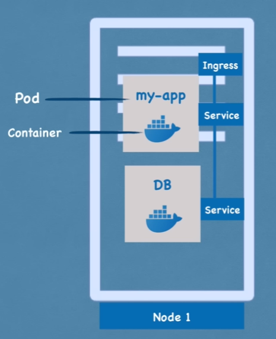
- Node: Holds the pods
- Pod:
    - Smallest unit of K8s
    - Abstraction over container
    - Pod usually runs one application container inside of it.
    - Each pod gets its own IP address.
    - **Note that pods are ephemeral, so if it dies, a new one will be created with a different IP address.**
- Service:
    - logical set of pods across the cluster (static IP, DNS name, load balancing).
    - Static IP address that can be attached to each pod.
    - Lifecyle of Pod and Service are not connected, resolving above issue.
    - External Service: Open to the internet.
    - Internal Service: Only open to other services within the cluster.
- Ingress:
    - We don't want to expose external services via their node IP address.
    - Request goes to Ingress, which then forwards to the correct service.

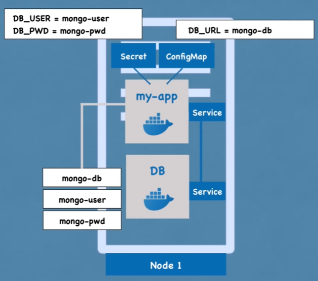
- ConfigMap:
    - External configuration to your application (URL's of a database)
    - Pods read from the Config Map.
- Secret:
    - Used to store secret data. Stored in base64 encoded format.
- Volumes:
    - Attaches a physical storage on a harddrive to a pod.
    - Could be on the local node itself, or remote storage outside of the K8s cluster.
    - **K8s doesn't manage the data persistence!**

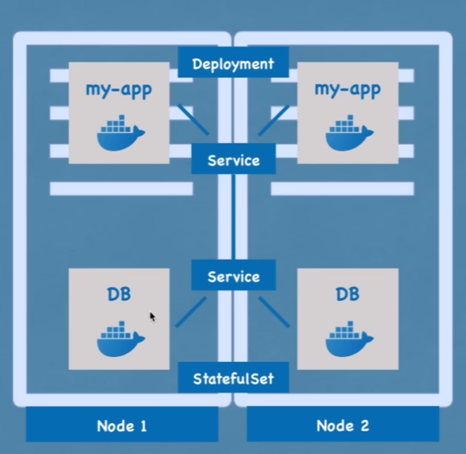
- Service:
    - Also a load balancer, which distributes traffic to pods across nodes.
- Deployment:
    - Define a blueprint for pods. You would specify the number of replicas of that pod you want.
    - Abstraction of pods.
- StatefulSet:
    - For stateful applications, like databases.
    - Deployment for stateLESS applications.
    - StatefulSet for stateFUL applications or databases.
    - **However, deploying StatefulSet is not easy :/. It's more common to host DB's outside of K8s.**

 ## Kubernetes Architecture

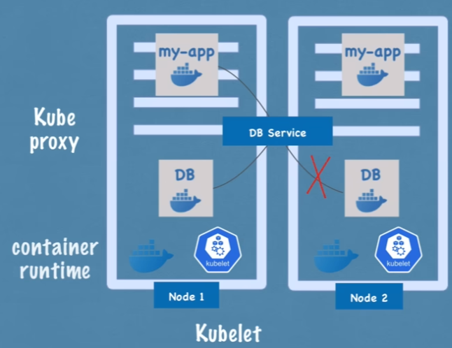
- Worker nodes actually do the work.
- 3 processes must be installed on every node:
    - Container runtime
    - Kubelet: Kubernetes process that interacts with both the container runtime and the node itself. Kubelet starts the pod with a container inside
    - Kube-proxy: Responsible for forwarding network traffic to the correct pod based on IP address.

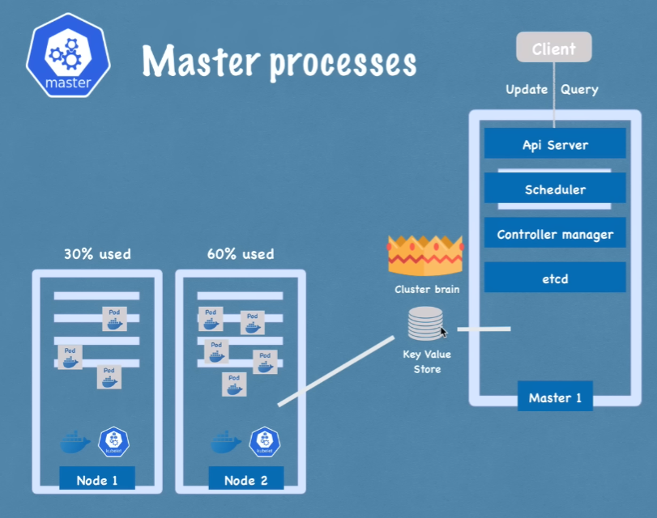
- Manages processes.
- 4 processes run on every master node:
    - API Server: Cluster gateway. Client updates/queries go through here.
    - Scheduler: Start pods on worker nodes, based on resource availability. Just decides which node the new pod should run on. THe process that actually starts the pod is Kubelet on the worker node.
    - Controller Manager: Detects cluster state changes (pod crashes). When detected, tries to recover the cluster to the desired state. For that, it makes a request to the scheduler, and the same cycle happens again.
    - etcd: Key Value Storage of the cluster state. Cluster brain. Cluster changes get stored in the key value store.

## Minikube and Kubectl

- Minikube:
    - One node cluster. Master processes and worker processes run on the same node.
    - Docker runtime installed by default, which run the containers inside the pods.
    - Node runs in a virtual box on your machine.
- Kubectl:
    - CLI tool to interact with the api server on the node.

## Main Kubectl Commands

- Pod is the smallest unit of K8s, but you are creating Deployment - abstraction over pod (which creates pods based on the blueprint you provide).

``` bash

# blueprint for creating pods
# most basic configuration for deployment (name and image to use)
# you can provide number of replicas here too.
(.venv) shad@linux:~$ kubectl create deployment nginx-depl --image=nginx
deployment.apps/nginx-depl created

(.venv) shad@linux:~$ kubectl get deployment
NAME         READY   UP-TO-DATE   AVAILABLE   AGE
nginx-depl   1/1     1            1           15s

(.venv) shad@linux:~$ kubectl get pod
NAME                          READY   STATUS    RESTARTS   AGE
nginx-depl-5fcbf6fffd-j25pv   1/1     Running   0          37s

# Replicaset is managing the replicas of the pod
# You usually don't interact with replicaset directly, but via deployment
(.venv) shad@linux:~$ kubectl get replicaset
NAME                    DESIRED   CURRENT   READY   AGE
nginx-depl-5fcbf6fffd   1         1         1       3m29s
```

- Layers of abstraction:
    - Deployment manages a...
    - ReplicaSet which manages a...
    - Pod is an abstraction over a...
    - Container which runs the application.
- Everything below Deployment should be handled by K8s itself.

``` bash
# Editing this, everything below got updated automatically.
(.venv) shad@linux:~$ kubectl edit deployment nginx-depl

(.venv) shad@linux:~$ kubectl create deployment mongo-depl --image=mongo
deployment.apps/mongo-depl created

(.venv) shad@linux:~$ kubectl get pod
NAME                          READY   STATUS              RESTARTS   AGE
mongo-depl-7d77bcb8c8-l6lb8   0/1     ContainerCreating   0          22s
nginx-depl-5fcbf6fffd-j25pv   1/1     Running             0          17m

(.venv) shad@linux:~$ kubectl get pod
NAME                          READY   STATUS    RESTARTS   AGE
mongo-depl-7d77bcb8c8-l6lb8   1/1     Running   0          6m15s
nginx-depl-5fcbf6fffd-j25pv   1/1     Running   0          23m

(.venv) shad@linux:~$ kubectl describe pod mongo-depl-7d77bcb8c8-l6lb8
Name:             mongo-depl-7d77bcb8c8-l6lb8
Namespace:        default
Priority:         0
Service Account:  default
Node:             minikube/192.168.39.186
Start Time:       Thu, 22 Jan 2026 22:27:58 +0000
Labels:           app=mongo-depl
                  pod-template-hash=7d77bcb8c8
Annotations:      <none>
Status:           Running
IP:               10.244.0.4
IPs:
  IP:           10.244.0.4
Controlled By:  ReplicaSet/mongo-depl-7d77bcb8c8
Containers:
  mongo:
    Container ID:   docker://d79a361e723dce35ee00fc32c2aee382bc93892cfa8a95c83cb97623aba5f882
    Image:          mongo
    Image ID:       docker-pullable://mongo@sha256:d6b569590880bca35e43318418133a426b024bcb649eeb63bb071bc1490bee41
    Port:           <none>
    Host Port:      <none>
    State:          Running
      Started:      Thu, 22 Jan 2026 22:28:27 +0000
    Ready:          True
    Restart Count:  0
    Environment:    <none>
    Mounts:
      /var/run/secrets/kubernetes.io/serviceaccount from kube-api-access-8fbc7 (ro)
Conditions:
  Type                        Status
  PodReadyToStartContainers   True 
  Initialized                 True 
  Ready                       True 
  ContainersReady             True 
  PodScheduled                True 
Volumes:
  kube-api-access-8fbc7:
    Type:                    Projected (a volume that contains injected data from multiple sources)
    TokenExpirationSeconds:  3607
    ConfigMapName:           kube-root-ca.crt
    Optional:                false
    DownwardAPI:             true
QoS Class:                   BestEffort
Node-Selectors:              <none>
Tolerations:                 node.kubernetes.io/not-ready:NoExecute op=Exists for 300s
                             node.kubernetes.io/unreachable:NoExecute op=Exists for 300s
Events:
  Type    Reason     Age    From               Message
  ----    ------     ----   ----               -------
  Normal  Scheduled  10m    default-scheduler  Successfully assigned default/mongo-depl-7d77bcb8c8-l6lb8 to minikube
  Normal  Pulling    10m    kubelet            spec.containers{mongo}: Pulling image "mongo"
  Normal  Pulled     9m33s  kubelet            spec.containers{mongo}: Successfully pulled image "mongo" in 27.013s (27.013s including waiting). Image size: 916294616 bytes.
  Normal  Created    9m32s  kubelet            spec.containers{mongo}: Created container: mongo
  Normal  Started    9m32s  kubelet            spec.containers{mongo}: Started container mongo

# Viewing logs of the mongo container
(.venv) shad@linux:~$ kubectl logs mongo-depl-7d77bcb8c8-l6lb8

# Debug within the container
(.venv) shad@linux:~$ kubectl exec -it mongo-depl-7d77bcb8c8-l6lb8 -- bin/bash
root@mongo-depl-7d77bcb8c8-l6lb8:/# ls
bin   data  docker-entrypoint-initdb.d  home        lib    media  opt   root  sbin  sys  usr
boot  dev   etc                         js-yaml.js  lib64  mnt    proc  run   srv   tmp  var
root@mongo-depl-7d77bcb8c8-l6lb8:/# exit
exit

(.venv) shad@linux:~/linux/notes/kubernetes$ kubectl get pod
NAME                          READY   STATUS    RESTARTS   AGE
mongo-depl-7d77bcb8c8-l6lb8   1/1     Running   0          36m
nginx-depl-5fcbf6fffd-j25pv   1/1     Running   0          53m

# CRUD happens at the deployment level, everything below happens automatically.
(.venv) shad@linux:~/linux/notes/kubernetes$ kubectl delete deployment mongo-depl
deployment.apps "mongo-depl" deleted from default namespace
(.venv) shad@linux:~/linux/notes/kubernetes$ kubectl get pod
NAME                          READY   STATUS    RESTARTS   AGE
nginx-depl-5fcbf6fffd-j25pv   1/1     Running   0          53m

(.venv) shad@linux:~/linux/notes/kubernetes$ kubectl delete deployment nginx-depl
deployment.apps "nginx-depl" deleted from default namespace

# For creating a deployment with configurations, there can me many options.
# Let's use a config file instead of CLI options.
(.venv) shad@linux:~$ kubectl create deployment <deployment_name> --image=<image_name> options...

# Create a deployment using a config file
(.venv) shad@linux:~/linux/notes/kubernetes$ kubectl apply -f nginx-deployment.yaml
deployment.apps/nginx-deployment created

(.venv) shad@linux:~/linux/notes/kubernetes$ kubectl get deployments
NAME               READY   UP-TO-DATE   AVAILABLE   AGE
nginx-deployment   2/2     2            2           3m57s
(.venv) shad@linux:~/linux/notes/kubernetes$ kubectl get pods
NAME                                READY   STATUS    RESTARTS   AGE
nginx-deployment-7f5cf9f489-dnzn8   1/1     Running   0          3m59s
nginx-deployment-7f5cf9f489-nw5fz   1/1     Running   0          3m59s
```

## K8s YAML Configuration File

- Each config file has 3 parts:
    - metadata
    - spec: specification of the component you are creating (deployment, service, etc)
        - Attributes of "spec" are specific to the component
    - status: automatically generated by Kubernetes.
        - K8s compares desired state (spec) with current state that's stored in etcd.
- template: Blueprint for creating pods. Within the `spec` of deployment.
- metadata:
    - you specify key-value pairs called labels (ex. `app: nginx`).
    - selector: used to select pods with specific labels (in both deployment and service).
- ports:
    - service:
        - port: Port that the service exposes internally within the cluster.
        - targetPort: Port that the pod is listening on.
    - container:
        - containerPort: Port that the container listens on (mapped to targetPort in service).

``` bash
(.venv) shad@linux:~$ minikube start --driver=kvm2
😄  minikube v1.37.0 on Ubuntu 24.04
✨  Using the kvm2 driver based on existing profile
👍  Starting "minikube" primary control-plane node in "minikube" cluster
🔄  Restarting existing kvm2 VM for "minikube" ...
🐳  Preparing Kubernetes v1.34.0 on Docker 28.4.0 ...
🔗  Configuring bridge CNI (Container Networking Interface) ...
🔎  Verifying Kubernetes components...
    ▪ Using image gcr.io/k8s-minikube/storage-provisioner:v5
🌟  Enabled addons: default-storageclass, storage-provisioner
🏄  Done! kubectl is now configured to use "minikube" cluster and "default" namespace by default

(.venv) shad@linux:~/linux/notes/kubernetes$ kubectl apply -f nginx-service.yaml
service/nginx-service created

(.venv) shad@linux:~/linux/notes/kubernetes$ kubectl get service
NAME            TYPE        CLUSTER-IP     EXTERNAL-IP   PORT(S)   AGE
kubernetes      ClusterIP   10.96.0.1      <none>        443/TCP   42h
nginx-service   ClusterIP   10.103.19.74   <none>        80/TCP    84s

(.venv) shad@linux:~/linux/notes/kubernetes$ kubectl describe service nginx-service
Name:                     nginx-service
Namespace:                default
Labels:                   <none>
Annotations:              <none>
Selector:                 app=nginx
Type:                     ClusterIP
IP Family Policy:         SingleStack
IP Families:              IPv4
IP:                       10.103.19.74
IPs:                      10.103.19.74
Port:                     <unset>  80/TCP
TargetPort:               8080/TCP

# IP Addresses and pords of the pods the service is routing to
Endpoints:                10.244.0.8:8080,10.244.0.9:8080
Session Affinity:         None
Internal Traffic Policy:  Cluster
Events:                   <none>

(.venv) shad@linux:~/linux/notes/kubernetes$ kubectl get pod -o wide
NAME                                READY   STATUS    RESTARTS      AGE   IP           NODE       NOMINATED NODE   READINESS GATES
nginx-deployment-7f5cf9f489-dnzn8   1/1     Running   1 (32h ago)   41h   10.244.0.8   minikube   <none>           <none>
nginx-deployment-7f5cf9f489-nw5fz   1/1     Running   1 (32h ago)   41h   10.244.0.9   minikube   <none>           <none>
(.venv) shad@linux:~/linux/notes/kubernetes$ kubectl get deployment nginx-deployment -o yaml > nginx-deployment-result.yaml

# Automatically generated status section
status:
  availableReplicas: 2
  conditions:
  - lastTransitionTime: "2026-01-22T23:11:31Z"
    lastUpdateTime: "2026-01-22T23:11:40Z"
    message: ReplicaSet "nginx-deployment-7f5cf9f489" has successfully progressed.
    reason: NewReplicaSetAvailable
    status: "True"
    type: Progressing
  - lastTransitionTime: "2026-01-24T16:02:22Z"
    lastUpdateTime: "2026-01-24T16:02:22Z"
    message: Deployment has minimum availability.
    reason: MinimumReplicasAvailable
    status: "True"
    type: Available
  observedGeneration: 1
  readyReplicas: 2
  replicas: 2
  updatedReplicas: 2

# Cleaning up
(.venv) shad@linux:~/linux/notes/kubernetes$ kubectl delete deployment nginx-deployment
deployment.apps "nginx-deployment" deleted from default namespace
(.venv) shad@linux:~/linux/notes/kubernetes$ kubectl delete service nginx-service
service "nginx-service" deleted from default namespace
(.venv) shad@linux:~/linux/notes/kubernetes$ kubectl get service
NAME         TYPE        CLUSTER-IP   EXTERNAL-IP   PORT(S)   AGE
kubernetes   ClusterIP   10.96.0.1    <none>        443/TCP   43h
(.venv) shad@linux:~/linux/notes/kubernetes$ kubectl get deployment
No resources found in default namespace.
```

## Complete Application Setup with Kubernetes Components

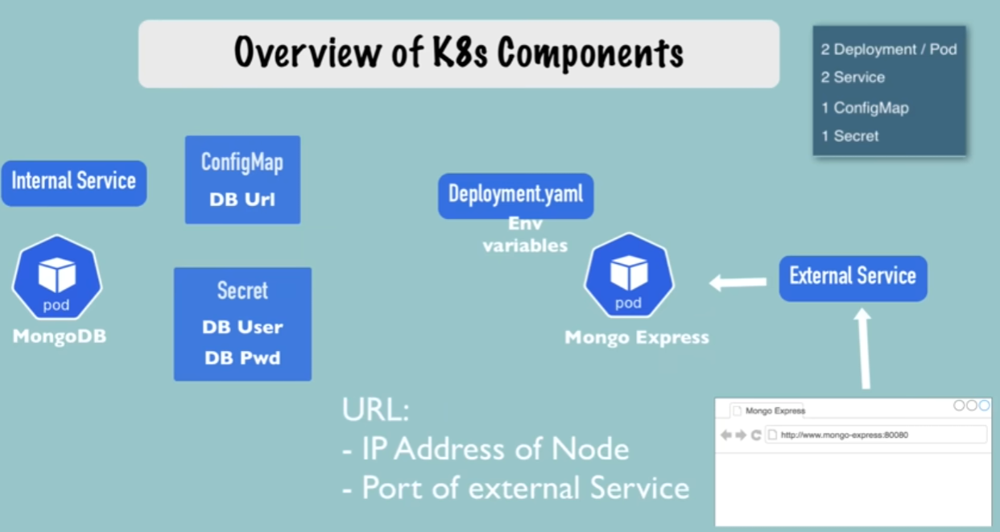

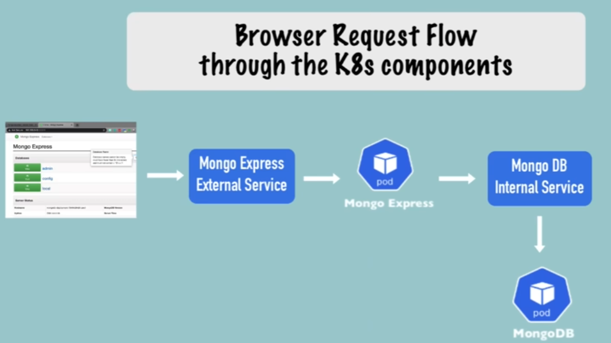

### Mongo Internal Deployment, Service, and Secret
``` bash
(.venv) shad@linux:~/linux/notes/kubernetes$ kubectl get all
NAME                 TYPE        CLUSTER-IP   EXTERNAL-IP   PORT(S)   AGE
service/kubernetes   ClusterIP   10.96.0.1    <none>        443/TCP   43h

(.venv) shad@linux:~/linux/notes/kubernetes/mongo$ cat mongo.yaml 
apiVersion: apps/v1
kind: Deployment
metadata:
  name: mongodb-deployment
  labels:
    app: mongodb
spec:
  replicas: 1
  selector:
    matchLabels:
      app: mongodb
  template:
    metadata:
      labels:
        app: mongodb
    spec:
      containers:
      - name: mongodb
        image: mongo
```

- Visiting https://hub.docker.com/_/mongo
    - `The MongoDB server in the image listens on the standard MongoDB port, 27017`
    - `When you start the mongo image, you can adjust the initialization of the MongoDB instance by passing one or more environment variables on the docker run command line. MONGO_INITDB_ROOT_USERNAME, MONGO_INITDB_ROOT_PASSWORD These variables, used in conjunction, create a new user and set that user's password.`
- Also in yaml, you can have multiple documents separated by `---`, which is how we'll distnguish our deployment and service files.

``` bash
ports:
    - containerPort: 27017
env:
- name: MONGO_INITDB_ROOT_USERNAME
    valueFrom:
    secretKeyRef:
        name: mongodb-secret
        key: mongo-root-username
- name: MONGO_INITDB_ROOT_PASSWORD
    valueFrom: 
    secretKeyRef:
        name: mongodb-secret
        key: mongo-root-password

(.venv) shad@linux:~/linux/notes/kubernetes/mongo$ kubectl apply -f mongo-secret.yaml 
secret/mongodb-secret created

# We can now reference this secret in our deployment file.
(.venv) shad@linux:~/linux/notes/kubernetes/mongo$ kubectl get secrets
NAME             TYPE     DATA   AGE
mongodb-secret   Opaque   2      7s

# Nice way to watch the pod status until it's running
(.venv) shad@linux:~/linux/notes/kubernetes/mongo$ kubectl get pod --watch
NAME                                  READY   STATUS    RESTARTS   AGE
mongodb-deployment-644cd66579-wrqd4   1/1     Running   0          23s

(.venv) shad@linux:~/linux/notes/kubernetes/mongo$ kubectl apply -f mongo.yaml 
# Notice that the deployment is unchanged since we only added the service.
deployment.apps/mongodb-deployment unchanged
service/mongodb-service created

(.venv) shad@linux:~/linux/notes/kubernetes/mongo$ kubectl get service -o wide
NAME              TYPE        CLUSTER-IP     EXTERNAL-IP   PORT(S)     AGE   SELECTOR
kubernetes        ClusterIP   10.96.0.1      <none>        443/TCP     44h   <none>
mongodb-service   ClusterIP   10.105.63.10   <none>        27017/TCP   43s   app=mongodb


# Cross reference pod IP with describe service to verify:
(.venv) shad@linux:~/linux/notes/kubernetes/mongo$ kubectl describe service mongodb-service
Name:                     mongodb-service
Namespace:                default
Labels:                   <none>
Annotations:              <none>
Selector:                 app=mongodb
Type:                     ClusterIP
IP Family Policy:         SingleStack
IP Families:              IPv4
IP:                       10.105.63.10
IPs:                      10.105.63.10
Port:                     <unset>  27017/TCP
TargetPort:               27017/TCP
Endpoints:                10.244.0.10:27017
Session Affinity:         None
Internal Traffic Policy:  Cluster
Events:                   <none>
(.venv) shad@linux:~/linux/notes/kubernetes/mongo$ kubectl get pod -o wide
NAME                                  READY   STATUS    RESTARTS   AGE   IP            NODE       NOMINATED NODE   READINESS GATES
mongodb-deployment-644cd66579-wrqd4   1/1     Running   0          17m   10.244.0.10   minikube   <none>           <none>
```

### Mongo External Deployment, Service, and ConfigMap

``` bash
(.venv) shad@linux:~/linux/notes/kubernetes/mongo$ cat mongo-external.yaml
apiVersion: apps/v1
kind: Deployment
metadata:
  name: mongo-express
  labels:
    app: mongo-express
spec:
  replicas: 1
  selector:
    matchLabels:
      app: mongo-express
  template:
    metadata:
      labels:
        app: mongo-express
    spec:
      containers:
      - name: mongo-express
        image: mongo-express
```

- Visiting https://hub.docker.com/_/mongo-express
    - `Then you can hit http://localhost:8081 or http://host-ip:8081 in your browser.`
    - What do we need to know?
        - Which database to connect to: `ME_CONFIG_MONGODB_SERVER`
        - Which credentials to authenticate: `ME_CONFIG_MONGODB_ADMINUSERNAME` and `ME_CONFIG_MONGODB_ADMINPASSWORD`

``` bash
ports:
- containerPort: 8081
env:
- name: ME_CONFIG_MONGODB_ADMINUSERNAME
    valueFrom:
    secretKeyRef:
        name: mongodb-secret
        key: mongo-root-username
- name: ME_CONFIG_MONGODB_ADMINPASSWORD
    valueFrom: 
    secretKeyRef:
        name: mongodb-secret
        key: mongo-root-password
- name: ME_CONFIG_MONGODB_SERVER
    value: # We'll read this from the ConfigMap. Let's create that first.

(.venv) shad@linux:~/linux/notes/kubernetes/mongo$ cat mongo-configmap.yaml 
apiVersion: v1
kind: ConfigMap
metadata:
  name: mongodb-configmap
data:
  database_url: mongodb-service
  (.venv) shad@linux:~/linux/notes/kubernetes/mongo$ kubectl apply -f mongo-configmap.yaml 
configmap/mongodb-configmap created
(.venv) shad@linux:~/linux/notes/kubernetes/mongo$ kubectl get configmap
NAME                DATA   AGE
kube-root-ca.crt    1      45h
mongodb-configmap   1      18s
(.venv) shad@linux:~/linux/notes/kubernetes/mongo$ kubectl apply -f mongo-express.yaml 
deployment.apps/mongo-express created
service/mongo-express-service created
(.venv) shad@linux:~/linux/notes/kubernetes/mongo$ kubectl get pod --watch
NAME                                  READY   STATUS              RESTARTS   AGE
mongo-express-868b544cd5-gtglv        0/1     ContainerCreating   0          8s
mongodb-deployment-644cd66579-wrqd4   1/1     Running             0          46m
mongo-express-868b544cd5-gtglv        1/1     Running             0          14s

---

apiVersion: v1
kind: Service
metadata:
  name: mongo-express-service
spec:
  selector:
    app: mongo-express
  type: LoadBalancer # Assigns service an external IP address and so accepts external requests.
  ports:
    - protocol: TCP
      port: 8081
      targetPort: 8081
      nodePort: 30000 # Port for external IP address

(.venv) shad@linux:~/linux/notes/kubernetes/mongo$ kubectl get service
NAME                    TYPE           CLUSTER-IP      EXTERNAL-IP   PORT(S)          AGE
kubernetes              ClusterIP      10.96.0.1       <none>        443/TCP          45h

# Load Balancer: Gives the external service both an internal and external IP address.
# Minikube a bit different, a regular Kubernetes setup would assign an external IP address here.
mongo-express-service   LoadBalancer   10.104.22.208   <pending>     8081:30000/TCP   10m

# ClusterIP: Gives the internal service an internal IP address.
mongodb-service         ClusterIP      10.105.63.10    <none>        27017/TCP        43m

(.venv) shad@linux:~/linux/notes/kubernetes/mongo$ minikube service mongo-express-service
┌───────────┬───────────────────────┬─────────────┬─────────────────────────────┐
│ NAMESPACE │         NAME          │ TARGET PORT │             URL             │
├───────────┼───────────────────────┼─────────────┼─────────────────────────────┤
│ default   │ mongo-express-service │ 8081        │ http://192.168.39.186:30000 │
└───────────┴───────────────────────┴─────────────┴─────────────────────────────┘
🎉  Opening service default/mongo-express-service in default browser...
👉  http://192.168.39.186:30000

(.venv) shad@linux:~/linux/notes/kubernetes/mongo$ curl -I -u 'admin:pass' http://192.168.39.186:30000/
HTTP/1.1 200 OK
X-Powered-By: Express
Content-Type: text/html; charset=utf-8
Content-Length: 9285
ETag: W/"2445-icUNDPt5es6u1mb2Sc3yXBKnc70"
Set-Cookie: mongo-express=s%3Ad2NQkbQxyOlfk6Zfpce_rXtMEJm5gZ5T.nNxKoQQeF9ecLXBgk71TEpxf6gCsh6AgpQtlteRc9bA; Path=/; HttpOnly
Date: Sat, 24 Jan 2026 19:14:58 GMT
Connection: keep-alive
Keep-Alive: timeout=5


(.venv) shad@linux:~/linux/notes/kubernetes/mongo$ kubectl port-forward svc/mongo-express-service 8081:8081 --address 127.0.0.1
Forwarding from 127.0.0.1:8081 -> 8081

ssh -L 8081:127.0.0.1:8081 shad@<redacted>
```

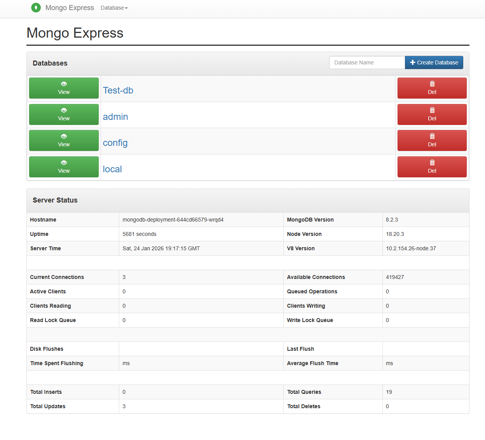

## Organizing your components with K8s Namespaces

``` bash
(.venv) shad@linux:~/linux/notes/kubernetes/mongo$ kubectl get namespaces
NAME              STATUS   AGE
default           Active   46h

# Heartbeats of nodes
# Each node has associated lease object in this namespace.
# Determines the availability of the node.
kube-node-lease   Active   46h

# Publicly accessible data
# A configmap, which contains cluster info
kube-public       Active   46h

# Don't create or modify in kube-system
# System processes, Master/Managing processes.
kube-system       Active   46h
```

- Why Namespaces?
    - Default namespace can get cluttered with many components.
    - Can have resources goruped in namespaces: Database, Monitoring, Nginx-Ingress, etc.
    - Avoids conflicts with same named resources (ex deployment name).
    - Also could have a Production-Blue and Production-Green namespace for blue-green deployments.
    - You can also set access control policies on namespaces (prevent team A from accessing team B's namespace).
    - You can also limit resource usage per namespace (ex. only allow 4 CPU cores and 8GB RAM in the "development" namespace).
- Caveats:
    - You can't access most resources from another Namespace. So projectB cannot access ProjectA's ConfigMap.
    - You CAN share a service across namespaces. Ex. accessible by (service-name).(namespace)
    - Some components can't be created within a Namespace, belong globally to the cluster: Nodes, PersistentVolumes `kubectl api-resources --namespaced=false`
    - `kubens <namespace_name>` to switch between namespaces easily. You need to install `kubectx` tool for this.

## K8s Ingress explained

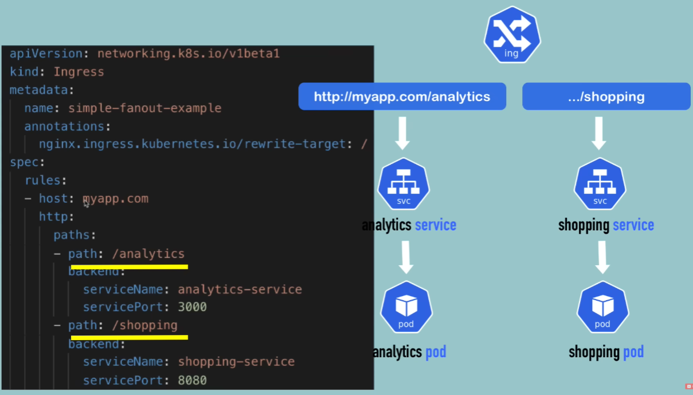
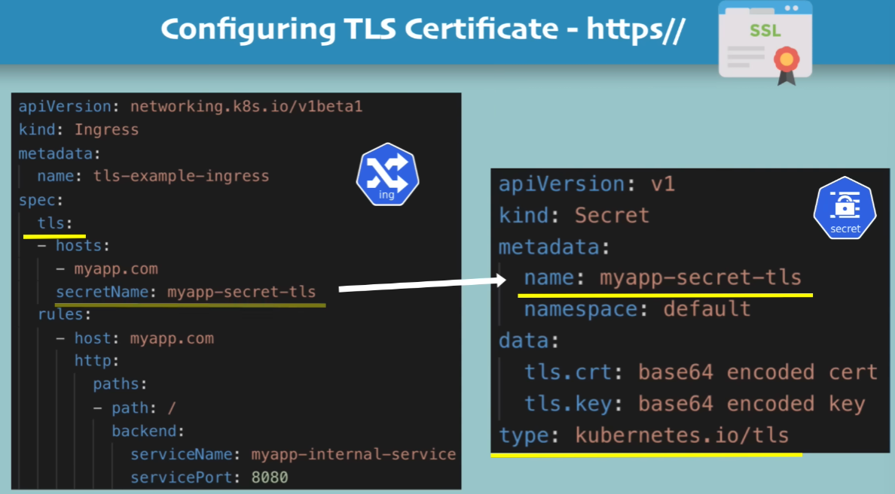

- External Service:
  - type: LoadBalancer means that the service gets an external IP address.
- Ingress:
  - Routing rules: Based on the request host and path, route to the correct service.
- Setup
  - You need an Ingress Controller Pod running in the cluster to process Ingress resources.
  - Evaluates all the rules, manages redirections, entrypoint to cluster, many third-party implementations
  - K8s Nginx Ingress Controller.
- Common strategies:
  - Data Plane: Azure LB → Ingress Service → Ingress Controller Pod → Backend Service → Pod
  - Control Plane: Ingress Resource → Ingress Controller

## Helm - Package Manager

- What is Helm?
  - Package Manager for Kubernetes - To package YAML files and distribute them in public and private repositories
    - Ex: Elastic Stack for Logging, would require Stateful Set, ConfigMap, Secret, K8s User, Services. Many YAML files.
    - Helm Chart: Collection of YAML files required to deploy an application.
    - Common Use Cases: Database Apps, Monitoring Apps (complex setups)
    - Helm Hub: Public repository of Helm Charts.
    - Public and Private Registries for Helm Charts.
  - Templating Engine
    - 1. Define a common blueprint, 2. Dynamic Values are replaced by placeholders (values.yaml)
    - Really good for CI/CD pipelines.
- Helm Chart Structure
  - mychart folder -> name of chart
  - Chart.yaml -> Metadata about the chart (name, version, description)
  - values.yaml -> Default values for the templates (you can override these during installation)
  - charts folder -> Dependency charts
  - templates folder -> YAML files with placeholders for dynamic values.

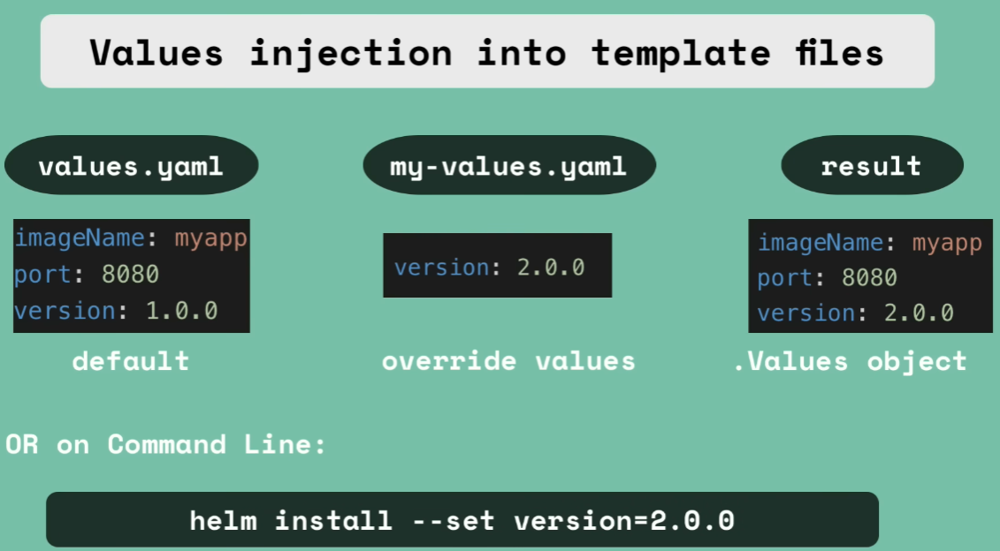

## Persisting Data in K8s with Volumes

- Pods are ephemeral, so data stored inside a pod is lost when the pod is deleted.
- Storage must be available on all nodes.
- Another usecase: Reading/Writing from a directory.
- Persistent Volume (PV):
  - A cluster resource
  - Created by a YAML file, kind: PersistentVolume, spec: how much storage?
  - PV needs actual physical storage. 
  - How do we hook up the interface to actual storage?
    - Local Disk on the node
    - Networked Storage: NFS, iSCSI
    - Cloud Storage: AWS EBS, GCP Persistent Disk, Azure Disk
  - PV is not namespaced, belongs to the whole cluster.
- DB persistence -> use remote storage over local volumes.
- K8s admin is the one to configure actual storage and create the PV components from these storage backends.
- Devs configure YAML files to use these PV's. Application has to claim the PersistentVolume. This is a PVC (PersistentVolumeClaim).
- Persistent Volume Claim (PVC):
  - Namespaced resource.
  - Created by a YAML file, kind: PersistentVolumeClaim, spec: how much storage
  - PVC requests storage from PV's based on size and access modes.
  - Use PVC in Pods configuration.

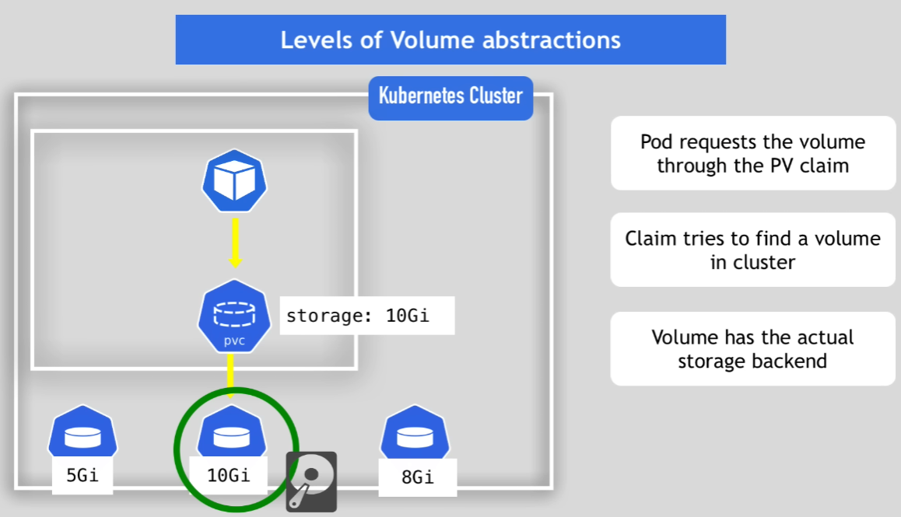


- Storage Class:
  - SC provisions Persistent Volumes dynamically, when PVC claims it.
  - Via "provisioner" field in the Storage Class.
  - Each storage backend has own provisioner.
  - internal provisioner "kubernetes.io/aws-ebs" for AWS EBS volumes or external provisioner.
  - configure parameters for strage we want to request for PV
  - Another abstraction level
      - Abstracts underlying storage provider
      - Parameters for that storage

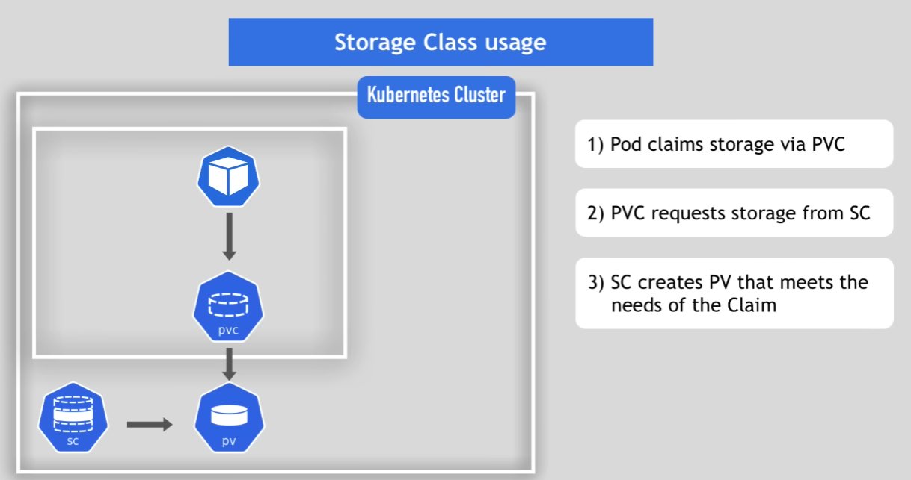

## Deploying Stateful Apps with StatefulSet 

- Why do we use StatefulSet over Deployment for stateful apps?
  - mysql pod replicas can't be created/deleted at same time
  - can't be randomly addressed
  - replica pods are not identical
    - Pod Identity
  - Pod Identity
    - Sticky Identity for each pod (ID-0, ID-1, ID-2)
    - Created from same specification, but not interchangeable!
    - persistent identifier across any re-scheduling
    - Sticky Identity important for DB clusters -> multiple read replicas, but only one write master. Pod retains state and role.
    - In StatefulSets, each Pod has a stable identity and its own dedicated PersistentVolumeClaim, which is preserved across restarts and not shared with other Pods.
  - Best practice is to use persistent remote storage for stateful applications.
  - Pod Identity:
    - Deployment: random hash
    - StatefulSet: fixed ordered names
  - 2 pod endpoints:
    - 1. Loadbalancer service DNS name - Deployment has this as well
    - 2. Individual Service Name - unique to StatefulSet
  - 2 charactersitics (IP Address changes, name and endpoint stays same):
    - 1. Predictable pod name: mysql-0
    - 2. Fixed individual DNS name mysql-0.svc2
- To be honest though, stateful applications are not perfect for containerized environments.

## K8s Services explained
- Pods are ephemeral, so their IP addresses can change.
- Service:
  - Provides a stable IP address
  - Loadbalancing
  - Loose coupling
  - within and outside the cluster
- Types of Services:
  - ClusterIP (default): Stable Internal IP address, only accessible within the cluster.
    - Microservice (port 3000) and logging (port 9000) containers in one pod.
    - Ingress talks to ClusterIP service to route traffic to the correct pod.
    - Which pod to forward the request to? Selector field in the service definition. Key value pairs (labels) to match the correct pod.
    - Which port to forward to? targetPort field in the service definition.
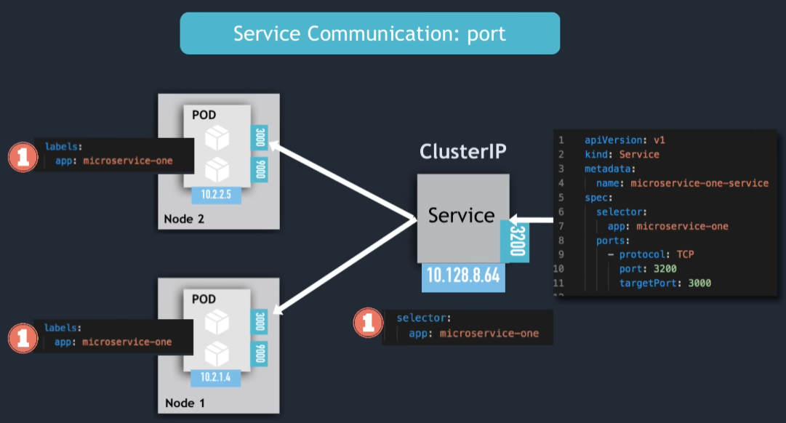
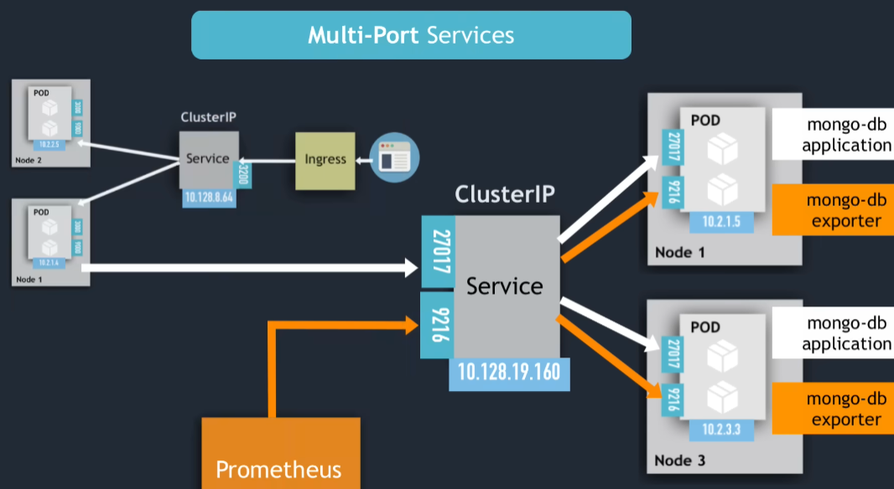
  - Headless Service:
    - Client wants to communicate with 1 specific pod directly.
    - Pods want to talk directly with specific Pod. 
    - Use case: Stateful applications, like databases (write operations must go to master pod).
    - How to create headless service? Set `clusterIP: None` in the service -> DNS returns the pod IPs directly.
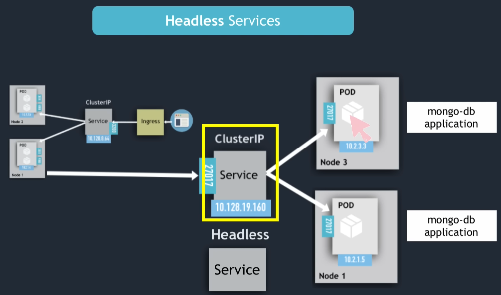
  - NodePort:
    - Exposes service on each node's IP address on a static port (30000-32767).
    - External clients can access the service using `<NodeIP>:<NodePort>`.
    - NodePort is built on top of ClusterIP, so service is accessible within the cluster as well.
    - ClusterIP only accessible within the cluster.
    - Service spans all worker nodes - so if you have 3 pod replicas on 3 different nodes, NodePort service will route to all 3 pods.
    - Can be insecure, as the nodes have open ports.
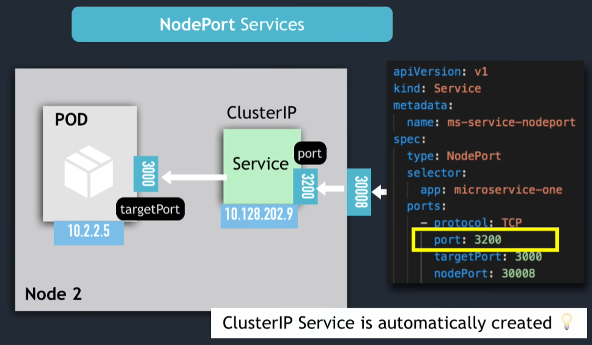
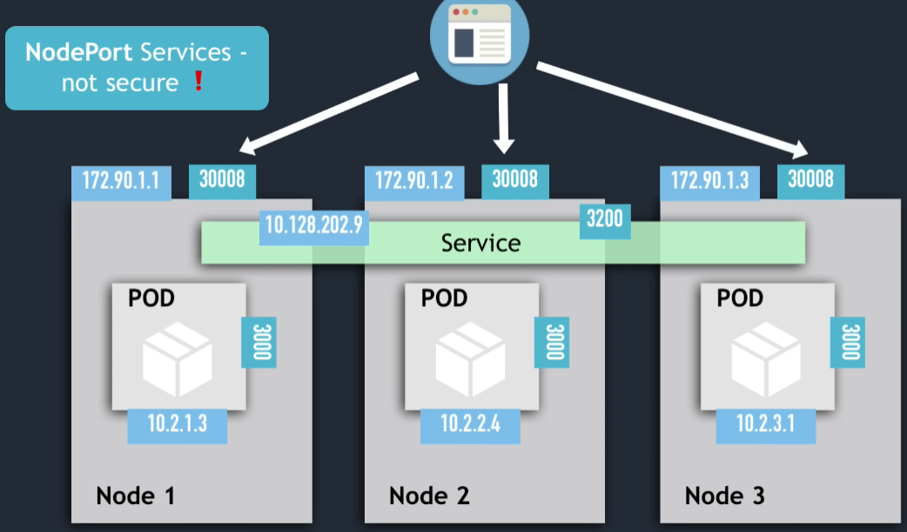
  - LoadBalancer:
    - Becomes accessible externally through cloud providers LoadBalancer.
    - LoadBalancer Service is an extension of NodePort Service, which is an extension of ClusterIP Service.
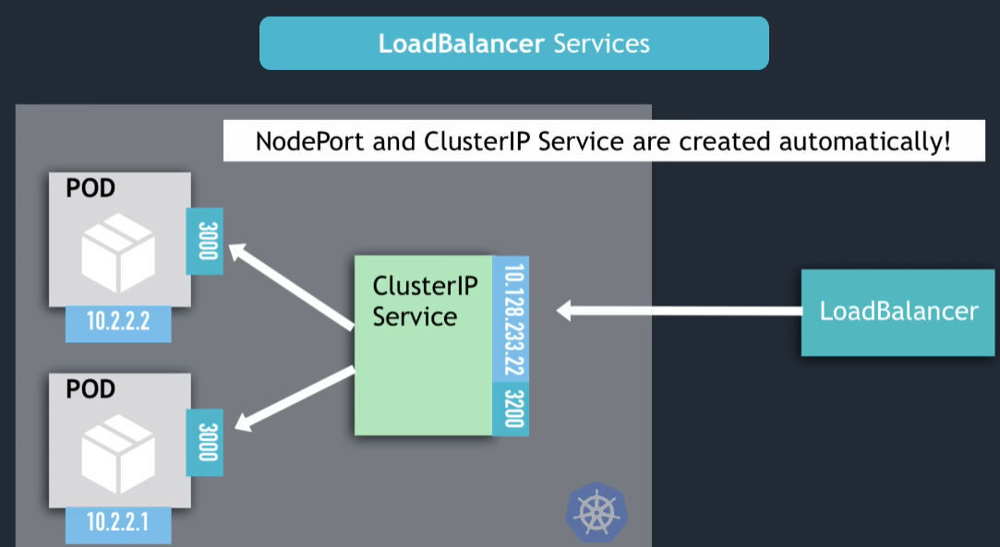
- Final Thoughts:
  - NodePort Service NOT for external connection
  - Configure Ingress or LoadBalancer for production environments
