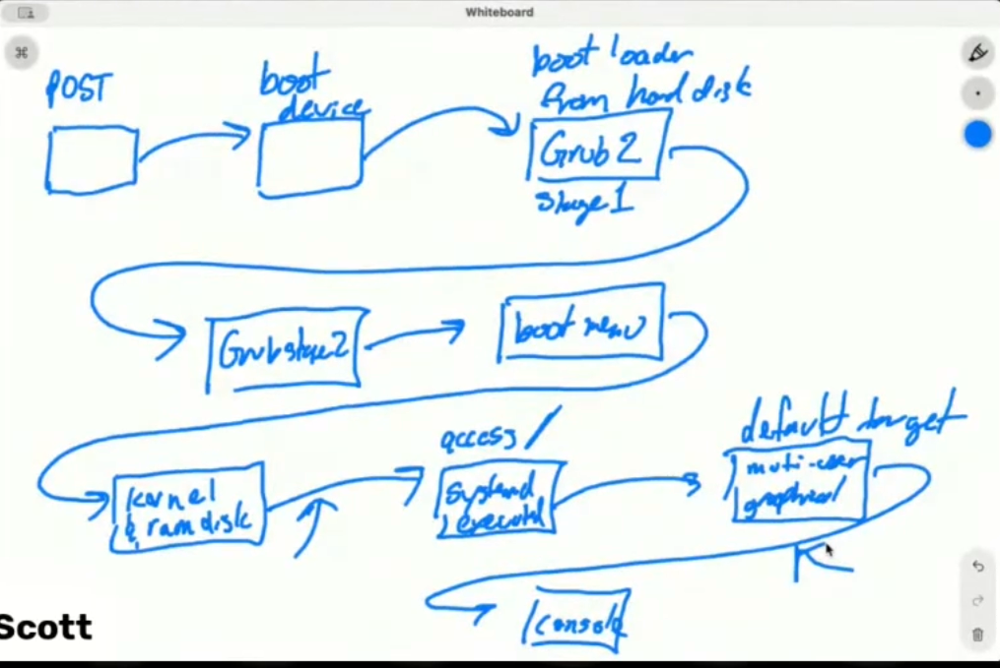

# [Boot Troubleshooting](https://www.youtube.com/watch?v=hRYxmYdRN60)

## Boot Tools

- A lot of the times, when troubleshooting boot, there commonly is file system problems.
- Tools we've used to debug file systems:
    - `df -h`: Disk free, but shows us which filesystems are mounted.
    - `fdisk -l`: List the file systems on your attached devices.
    - `lsblk`: List block devices in tree format.
    - `blkid`: Will show you the UUIDs of your partitions.
    - `mount`: Show currently mounted file systems. Shad: `findmnt` helps to see what's mounted.
- Covering some new tools today.

### fsck (filesystem check)

``` bash

# fsck must be run on unmounted file systems.
root@linux:/home/shad# umount /mnt

root@linux:/home/shad# fsck /mnt
fsck from util-linux 2.39.3
e2fsck 1.47.0 (5-Feb-2023)
/dev/sdb1: clean, 12/1048576 files, 93480/4193792 blocks

# undo
root@linux:/home/shad# mount /dev/sdb1 /mnt
```

- Checks the FS state, if it's a dirty state (not unmounted cleanly), will be able to fix it.

### grub-install

- bootloader is important for booting.

``` bash

oot@linux:/home/shad# grub-install /dev/sda
Installing for x86_64-efi platform.
Installation finished. No error reported.
```

- Will take our grub config file that is in boot and translate it into a master boot record or UEFI BIOS stored boot record for our machine.

## What happens at boot?



1. Hardware Initializes: The motherboard firmware (BIOS/UEFI) performs POST, shows the vendor splash screen, and initializes hardware. This stage is independent of Linux and controlled entirely by the hardware vendor.
2. Boot Device Selection: The BIOS/UEFI firmware scans the boot order configured in its settings, checks each device in priority order, and picks the first one that is bootable. Normally this ends up being the internal hard disk/SSD.
3. The bootloader is executed from the MBR (for BIOS systems) or from the EFI System Partition (for UEFI systems) on the selected boot device. The bootloader, such as GRUB, is responsible for loading the Linux kernel into memory.
    1. Red Hat transitioned from GRUB Legacy to GRUB2. GRUB2 still has a minimal Stage-1 bootloader that resides in the MBR (BIOS) or is referenced by UEFI. Stage-1’s only real job is to locate and load Stage-2. It cannot parse full configuration files or present menus by itself.
    2. GRUB Stage-2 is the full bootloader binary stored on the filesystem under /boot. Stage-2 can read its configuration (grub.cfg), construct the boot menu, and allow the user to select or edit boot entries.
    3. When a menu entry is chosen, Stage-2 loads the corresponding kernel image from /boot into memory and then transfers control to that kernel, which continues the rest of the boot sequence.
4. Kernel & Ram Disk: The selected kernel and its associated initramfs (initial RAM disk) are uncompressed into memory. Once the kernel takes control, it begins hardware initialization and outputs the kernel boot messages you see on the console.
5. systemd executed: After the kernel mounts the / filesystem in read-only mode, it starts the init process, which on modern Linux systems is systemd.
6. default target: systemd reads its configuration to determine the system’s default target. This is typically multi-user.target for server setups or graphical.target if a desktop environment is installed. Based on that target, systemd performs all the necessary steps to bring the machine to its fully booted state.
    1. enabling services
    2. mounting file systems from /etc/fstab
    3. remount `/` to read-write
    4. it starts up the console for you to log into. graphical.target = GUI login screen, multi-user.target = text-based tty login prompt

- So this is the order of things that happen during boot.

## Troubleshooting fstab

- `[ TIME ] Timed out waiting for device /dev/mapper/rhel-dat` (trouble which device)
- `[ DEPEND ] Dependency failed for /data.` (which mount point)
- It was in the mounting local file systems task.
- The machine booted to emergency mode, systemd mounted the file system read-write, we got prompt to log in as root to fix the problem.
- So at least `/` was accessible.
- `df -h` to see what file systems are mounted. We don't have `/data` mounted.
- Check `/etc/fstab`, we see there's a listing for `/data`. The logical volume `/dev/mapper/rhel-dat` is having trouble being accessed.
- Run `lvs`, list of logical volumes. In the `/etc/fstab`, it's looking for `rhel-dat`, but in `lvs`, it's actually called `rhel-data`. Go back to `/etc/fstab` and fix the typo.
- Save the file, then `exit` to continue booting.
- Common issue: Create a new file system => mount it => make sure everything's good => create a new entry in `/etc/fstab` so that it mounts automatically at boot => you did a typo in `/etc/fstab` => next reboot, it fails to mount that file system => boots to emergency mode.
- To verify, `umount /data` (if it's mounted), then `mount -a` to try to mount everything in `/etc/fstab`. If no errors, then it's good. You might need to run `systemctl daemon-reload` to reload systemd's configuration before running `mount -a`.

## Troubleshooting initramfs

- `initramfs-xxxx.img not found`
- `Kernel panic - not syncing: VFS: Unable to mount root fs on unknown-block(0,0)`
- Could be as bad as data is missing, or a simple typo.
- Do a force reboot, second option in GRUB menu is RHEL rescue mode. 

``` bash
shad@linux:~$ ls /boot
System.map-6.14.0-1012-azure  grub                          lost+found
System.map-6.14.0-1014-azure  initrd.img                    vmlinuz
config-6.14.0-1012-azure      initrd.img-6.14.0-1012-azure  vmlinuz-6.14.0-1012-azure
config-6.14.0-1014-azure      initrd.img-6.14.0-1014-azure  vmlinuz-6.14.0-1014-azure
efi                           initrd.img.old                vmlinuz.old
```

- We do see initramfs files there.
- In the example, one of the entries of above command for the initramfs file had an extra `.`, where as the error message said it was looking for the file without the extra `.`.
- So GRUB configuration was looking for a file that was misnamed.
- `sudo cat /boot/grub/grub.cfg` this is the grub configuration file that GRUB stage 2 reads.
- How did this happen?
    - Changing the GRUB config manually
    - Generating a new initramfs file with `dracut` but made a typo in the command.

## Troubleshooting superblocks

- `cat /etc/fstab` to see what should be mounted.
- `df -h` to see what is mounted (and compare against fstab).
- For our example, I don't see `/mnt` mounted.
- Can verify with `mount -a`, we get the error `dev/sda2 already mounted or mount point busy`.
- `mount /dev/sda2 /mnt` gives us the error `unknown filesystem type 'LVM2_member'`.
- So, this is what things look like when you have file system corruption.
- Since `/dev/sda2` is not mounted, let's run `fsck /dev/sda2` on it. Checks inodes, blocks, files, checks directory structures, check reference counts. It founds some bitmap differences, fix them? Yes.
- `fsck -y /dev/sda2` to automatically fix any errors.
- So fsck repaired a lot of filesystem issues with `/dev/sda2`.
- Now we can run `mount -a` again, and this time it works and so will rebooting the machine.
- What happened? The superblock on the file system got corrupted (via `dd`).
- The superblock: Tells the mount command what the properties of the file systems, how to work with the file system, what file system format it is, this was corrupted and couldn't be read. `fsck` was able to repair it.
