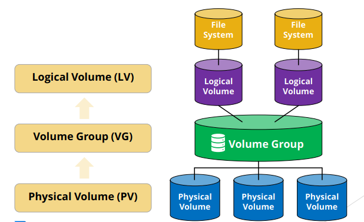

# LVM

## Local Setup using Loopback Devices
``` bash
(.venv) shad@linux:~/lvm$ pwd
/home/shad/lvm

# Create two 1 GB virtual disks
sudo mkdir -p /lab
cd /lab

sudo truncate -s 1G disk1.img
sudo truncate -s 1G disk2.img

# Attach them as loopback devices
sudo losetup -fP disk1.img
sudo losetup -fP disk2.img

(.venv) shad@linux:~/lvm$ losetup -a
/dev/loop1: []: (/home/shad/lvm/disk2.img)
/dev/loop0: []: (/home/shad/lvm/disk1.img)
```

## [Linux Logical Volume Manager (LVM) Deep Dive Tutorial](https://www.youtube.com/watch?v=MeltFN-bXrQ)

### Why LVM?
- `cat /dev/zero > /var/log/application.log` was run, filling up the disk.
- LVM could grow the filesystem, but we don't have LVM set up.
- Can do `truncate -s 0 /var/log/application.log` to free up space, but we did lose logging data.
- Gzip could've worked, but the drive was still full.

### LVM Explanation

- Physical Volume (PV): A physical storage device (HDD, SSD, etc.) or a partition on such a device that has been initialized for use by LVM.
- Volume Group (VG): Arbitrary container for logical volumes. It can be expanded by adding more physical volumes.
- Logical Volume (LV): When you create a logical volume, you can format it with a filesystem and mount it. Once the Volume Group is expanded, you can also extend the Logical Volume as well to use the additional space.
    - So rather than `Filesystem -> Partition -> Disk`, with LVM, you can have `Filesystem -> Logical Volume -> Volume Group -> Physical Volumes -> Disks or Partitions`

### Viewing LVM Info

``` bash

# Create Physical Volumes
(.venv) shad@linux:~/lvm$ sudo pvcreate /dev/loop0 /dev/loop1
  Physical volume "/dev/loop0" successfully created.
  Physical volume "/dev/loop1" successfully created.

# Display Physical Volumes
(.venv) shad@linux:~/linux/notes/images$ sudo pvdisplay
  --- Physical volume ---
  PV Name               /dev/loop0
  VG Name               vgtest
  PV Size               1.00 GiB / not usable 4.00 MiB
  Allocatable           yes 
  PE Size               4.00 MiB
  Total PE              255
  Free PE               130
  Allocated PE          125
  PV UUID               r6KDTt-uJDA-cGbo-8KcY-ATuB-UnsA-zLZUZJ
   
  --- Physical volume ---
  PV Name               /dev/loop1
  VG Name               vgtest
  PV Size               1.00 GiB / not usable 4.00 MiB
  Allocatable           yes 
  PE Size               4.00 MiB
  Total PE              255
  Free PE               255
  Allocated PE          0
  PV UUID               Zoe8Je-zlz0-jRie-O0gO-anOP-bYkR-TesugH

# Create the first Volume Group
(.venv) shad@linux:~/lvm$ sudo vgcreate vgtest /dev/loop0
  Volume group "vgtest" successfully created

# Expand Volume Group
(.venv) shad@linux:~/lvm$ sudo vgextend vgtest /dev/loop1
  Volume group "vgtest" successfully extended

# Display Volume Group
(.venv) shad@linux:/mnt/lvdata$ sudo vgdisplay
  --- Volume group ---
  VG Name               vgtest
  System ID             
  Format                lvm2
  Metadata Areas        2
  Metadata Sequence No  3
  VG Access             read/write
  VG Status             resizable
  MAX LV                0
  Cur LV                1
  Open LV               1
  Max PV                0
  Cur PV                2
  Act PV                2
  VG Size               1.99 GiB
  PE Size               4.00 MiB
  Total PE              510
  Alloc PE / Size       125 / 500.00 MiB
  Free  PE / Size       385 / 1.50 GiB
  VG UUID               LNg4Tf-MAAA-JmWo-05ht-ZOXy-do3U-G183WH

# Create Logical Volume
(.venv) shad@linux:~/lvm$ sudo lvcreate -n lvdata -L 500M vgtest
  Logical volume "lvdata" created.

# Display Logical Volume
(.venv) shad@linux:~/linux/notes/images$ sudo lvdisplay
  --- Logical volume ---
  LV Path                /dev/vgtest/lvdata
  LV Name                lvdata
  VG Name                vgtest
  LV UUID                Q5We63-EUDB-AJ45-LeRk-J6Im-Q9h6-0At5PY
  LV Write Access        read/write
  LV Creation host, time linux, 2025-12-30 23:12:32 +0000
  LV Status              available
  # open                 0
  LV Size                500.00 MiB
  Current LE             125
  Segments               1
  Allocation             inherit
  Read ahead sectors     auto
  - currently set to     256
  Block device           252:0

# Make a Filesystem on the Logical Volume
(.venv) shad@linux:~/linux/notes/images$ sudo mkfs.ext4 /dev/vgtest/lvdata
mke2fs 1.47.0 (5-Feb-2023)
Discarding device blocks: done                            
Creating filesystem with 128000 4k blocks and 128000 inodes
Filesystem UUID: 25bcd5d9-0e06-4638-9663-645df39bec00
Superblock backups stored on blocks: 
        32768, 98304

Allocating group tables: done                            
Writing inode tables: done                            
Creating journal (4096 blocks): done
Writing superblocks and filesystem accounting information: done

(.venv) shad@linux:~/linux/notes/images$ sudo mkdir -p /mnt/lvdata
(.venv) shad@linux:~/linux/notes/images$ sudo mount /dev/vgtest/lvdata /mnt/lvdata

# Verify with lsblk
(.venv) shad@linux:~/linux/notes/images$ lsblk
NAME            MAJ:MIN RM  SIZE RO TYPE MOUNTPOINTS
loop0             7:0    0    1G  0 loop 
└─vgtest-lvdata 252:0    0  500M  0 lvm  /mnt/lvdata
loop1             7:1    0    1G  0 loop 
sda               8:0    0   30G  0 disk 
├─sda1            8:1    0   29G  0 part /
├─sda14           8:14   0    4M  0 part 
├─sda15           8:15   0  106M  0 part /boot/efi
└─sda16         259:0    0  913M  0 part /boot
sdb               8:16   0   16G  0 disk 
└─sdb1            8:17   0   16G  0 part /mnt

# Check disk space
(.venv) shad@linux:/mnt/lvdata$ df -h
Filesystem                 Size  Used Avail Use% Mounted on
/dev/mapper/vgtest-lvdata  452M   24K  417M   1% /mnt/lvdata
```

### Expanding a file system
``` bash
# Extend Logical Volume by 250 MB
(.venv) shad@linux:/mnt/lvdata$ sudo lvextend -L +1260M /dev/vgtest/lvdata
  Rounding size to boundary between physical extents: 260.00 MiB.
  Size of logical volume vgtest/lvdata changed from 760.00 MiB (190 extents) to 1.23 GiB (315 extents).
  Logical volume vgtest/lvdata successfully resized.

# Even though LV is extended, filesystem is still same size
(.venv) shad@linux:/mnt/lvdata$ df -h
Filesystem                 Size  Used Avail Use% Mounted on
/dev/mapper/vgtest-lvdata  697M   24K  652M   1% /mnt/lvdata

# Resize the filesystem to use the new space
(.venv) shad@linux:~/lvm$ sudo resize2fs /dev/vgtest/lvdata
resize2fs 1.47.0 (5-Feb-2023)
Filesystem at /dev/vgtest/lvdata is mounted on /mnt/lvdata; on-line resizing required
old_desc_blocks = 1, new_desc_blocks = 1
The filesystem on /dev/vgtest/lvdata is now 322560 (4k) blocks long.

# Verify new size
(.venv) shad@linux:/mnt/lvdata$ df -h
Filesystem                 Size  Used Avail Use% Mounted on
/dev/mapper/vgtest-lvdata  1.2G   24K  1.1G   1% /mnt/lvdata

# To resize both the LV and filesystem to use all free space in VG
(.venv) shad@linux:/mnt/lvdata$ sudo lvextend --resizefs -l +100%FREE /dev/vgtest/lvdata

# Note that segments increased from 1 to 2
(.venv) shad@linux:~/lvm$ sudo lvdisplay
  --- Logical volume ---
  LV Path                /dev/vgtest/lvdata
  LV Name                lvdata
  VG Name                vgtest
  LV UUID                Q5We63-EUDB-AJ45-LeRk-J6Im-Q9h6-0At5PY
  LV Write Access        read/write
  LV Creation host, time linux, 2025-12-30 23:12:32 +0000
  LV Status              available
  # open                 1
  LV Size                1.23 GiB
  Current LE             315
  Segments               2
  Allocation             inherit
  Read ahead sectors     auto
  - currently set to     256
  Block device           252:0
```

- pvs/vgs/lvs: summary information
- pvdisplay/vgdisplay/lvdisplay: detailed information