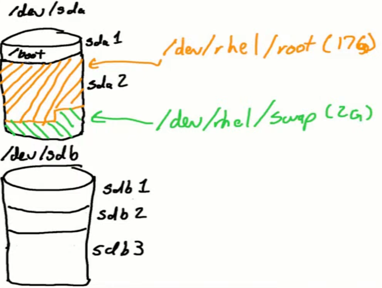
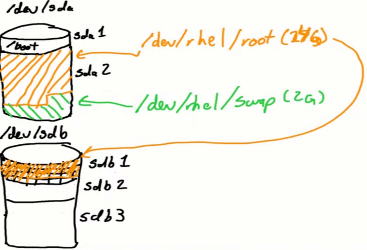

# Troubleshooting Logical Volume Manager (LVM)

## Storage Toolbox

- There is 3 abstraction layers between the devices and the data you're storing in the filesystem.

``` bash
# Physical layer
(.venv) shad@linux:~/linux/notes/os/rhel$ sudo pvs
  PV         VG     Fmt  Attr PSize    PFree   
  /dev/loop0 vgtest lvm2 a--  1020.00m  260.00m
  /dev/loop1 vgtest lvm2 a--  1020.00m 1020.00m

# PE Size = Physical Extent Size
# How much disk space is individually allocatable in this physical volume.
(.venv) shad@linux:~/linux/notes/os/rhel$ sudo pvdisplay
  --- Physical volume ---
  PV Name               /dev/loop0
  VG Name               vgtest
  PV Size               1.00 GiB / not usable 4.00 MiB
  Allocatable           yes 
  PE Size               4.00 MiB
  Total PE              255
  Free PE               65
  Allocated PE          190
  PV UUID               r6KDTt-uJDA-cGbo-8KcY-ATuB-UnsA-zLZUZJ
   
  --- Physical volume ---
  PV Name               /dev/loop1
  VG Name               vgtest
  PV Size               1.00 GiB / not usable 4.00 MiB
  Allocatable           yes 
  PE Size               4.00 MiB
  Total PE              255
  Free PE               255
  Allocated PE          0
  PV UUID               Zoe8Je-zlz0-jRie-O0gO-anOP-bYkR-TesugH

# Volume Groups stored across thes physical volume
(.venv) shad@linux:~/linux/notes/os/rhel$ sudo vgs
  VG     #PV #LV #SN Attr   VSize VFree
  vgtest   2   1   0 wz--n- 1.99g 1.25g

(.venv) shad@linux:~/linux/notes/os/rhel$ sudo vgdisplay
  --- Volume group ---
  VG Name               vgtest
  System ID             
  Format                lvm2
  Metadata Areas        2
  Metadata Sequence No  5
  VG Access             read/write
  VG Status             resizable
  MAX LV                0
  Cur LV                1
  Open LV               1
  Max PV                0
  Cur PV                2
  Act PV                2
  VG Size               1.99 GiB
  PE Size               4.00 MiB
  Total PE              510
  Alloc PE / Size       190 / 760.00 MiB
  Free  PE / Size       320 / 1.25 GiB
  VG UUID               LNg4Tf-MAAA-JmWo-05ht-ZOXy-do3U-G183WH

# Logical Volumes stored within the Volume Groups
(.venv) shad@linux:~/linux/notes/os/rhel$ sudo lvs
  LV     VG     Attr       LSize   Pool Origin Data%  Meta%  Move Log Cpy%Sync Convert
  lvdata vgtest -wi-ao---- 760.00m

# Segments = Continuous blocks of disk storage that you use to store this logical volume.
(.venv) shad@linux:~/linux/notes/os/rhel$ sudo lvdisplay
  --- Logical volume ---
  LV Path                /dev/vgtest/lvdata
  LV Name                lvdata
  VG Name                vgtest
  LV UUID                Q5We63-EUDB-AJ45-LeRk-J6Im-Q9h6-0At5PY
  LV Write Access        read/write
  LV Creation host, time linux, 2025-12-30 23:12:32 +0000
  LV Status              available
  # open                 1
  LV Size                760.00 MiB
  Current LE             190
  Segments               1
  Allocation             inherit
  Read ahead sectors     auto
  - currently set to     256
  Block device           252:0

# *vs = real quick simple couple lines of summary information
# *display = detailed information.
```

### What is Logical Volume Manager?


- /dev/sda1 has /boot partition, standalone file system.
- /dev/sda2 is LVM Physical Volume (PV).


- `pvcreate /dev/sdb1` -> creates metadata vgda (Volume Group Descriptor Area) on /dev/sdb1 to make it a Physical Volume.
- `vgextend` to add the new PV to existing Volume Group (VG) named `/dev/rhel`. So the PV now has allocatable extents.
- `lvextend` to extend the Logical Volume (LV) named `/dev/rhel/root` to add 4GBs of space. So `/dev/rhel/root` went from 17 GBs to 21 GBs.
- Even though we extended our logical volume to account for the new space, it had not been formatted with our filesystem. So `xfs_growfs /dev/rhel/root` to push that filesystem format to the new space so that the OS can use it.
- One thing to note is that when running `lvdisplay /dev/rhel/root`, we see that `Segments` is now 2.
    - Before, it had been on 1 segment, 1 contiguous block of extents inside our VG.
    - Now, it's stored across multiple devices, there are some extents on `dev/sda` and on `dev/sdb`.

### Phasing out a disk

``` bash

# Move all data off of /dev/sdb1 to other physical volumes in the same volume group.
pvmove /dev/sdb1

# Now we can remove /dev/sdb1 from the volume group.
vgreduce rhel /dev/sdb1

# Retire it - wipes off the VGDA metadata on the physical volume.
# Don't forget this! Recall we logged the physical volumes that are attached to this machine in some metadata files. And if we disconnect the disk without running this command, next time we boot and we're trying to reconstitute our VG layout, it'll look for that device and won't find it, causing errors.
pvremove /dev/sdb1
```

### Conclusion

- 3 Layers:
    - Physical Layer: What disk devices are making up your logical volume management infra?
    - Volume Group Layer: Taking devices and tying them together into a meta device called a Volume Group. That can span multiple physical devices.
    - Logical Volume: How you then claim portions of that Volume Group space to store filesystems on.
- `lvextend` to grow logical volumes and grab more space from the volume group.
- `lvcreate` to create new logical volumes within the volume group.
- `xfs_growfs` to push that filesystem into our newly allocated space to our existing logical volume and filesystem space.
- `mkfs.xfs` to create a new filesystem on a newly created logical volume.
- Keep aware of what physical devices are components of your volume group.
- To retire a disk, use `pvmove` to move data off of it, `vgreduce` to remove it from the volume group, and `pvremove` to wipe the metadata off the physical volume.
- *Is LVM slower than using straight disk partitions?* 
    - Yes, we have to go through metadata to determine where data is stored. So that does take extra compute time.
    - **Reality is, it's not perceivable to processes and peoples.**
    - Benchmarkings have shown no perceivable degradation between partition formatted filesystems and LVM formatted filesystems.

> So enjoy the flexibility that LVM provides you :)