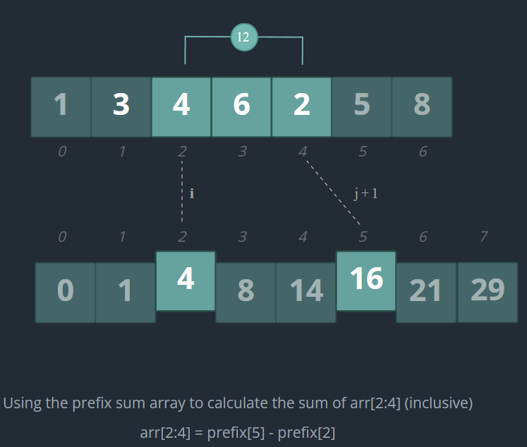

# HelloInterview Patterns

# Two Pointers

## Eliminating Pairs

- Two-pointer technique leverages the fact that the input array is sorted.
- To eliminate the number of pairs we consider from O(n^2) down to O(n).

## When do I use this?

- Involve searching for a pair (or more) of items in an array that meet a certain criteria. Eliminating unnecessary pairs.
- Each pointer represents a logical “region” of the array.

# Sliding Window

## Variable-length Sliding Windows

### **Template**

Here's a template you can use as a starting point for solving problems with a variable-length sliding window.

```python
def variable_length_sliding_window(nums):
    state = # choose appropriate data structure
    start = 0
    max_ = 0

    for end in range(len(nums)):
        # extend window
        # add nums[end] to state in O(1) in time

        while state is not valid:
            # repeatedly contract window until it is valid again
            # remove nums[start] from state in O(1) in time
            start += 1

        # INVARIANT: state of current window is valid here.
        max_ = max(max_, end - start + 1)

    return max_
```

## Fixed-length Sliding Windows

- When you **know the length** of the subsequence you are looking for, you can use a fixed-length sliding window.
- The concept is similar to the variable-length sliding window, but the implementation is a bit simpler, as during each iteration, you both add and remove an element from the window to maintain its fixed size.

### **Template**

Here's a template you can use as a starting point for solving problems with a fixed-length sliding window.

```python
def fixed_length_sliding_window(nums, k):
    state = # choose appropriate data structure
    start = 0
    max_ = 0

    for end in range(len(nums)):
        # extend window
        # add nums[end] to state in O(1) in time

        if end - start + 1 == k:
            # INVARIANT: size of the window is k here.
            max_ = max(max_, contents of state)

            # contract window
            # remove nums[start] from state in O(1) in time
            start += 1

    return max_
```

## When do I use this?

- Involve **searching for a continuous subsequence** in an array or string that satisfies a certain constraint.
- If you know the length of the subsequence you are looking for, use a fixed-length sliding window. Otherwise, use a variable-length sliding window.
- It is important to think about the appropriate data structure state to store the contents of the current window. Make sure it supports both:
    - Adding and removing elements from the window in O(1) time.
    - Checking if the window is valid in O(1) time.

# Linked List

## Overview

- Shad: Can handle `head`  as an edge case (ex. remove node from LL)

## Operations to know for interviews

### 1. Fast and Slow Pointers

- Fast and slow pointers is a technique that is used to find the middle node in a linked list.
- The same fast and slow pointers technique can also be used to determine if a linked list contains a cycle. If we follow the same iteration pattern and the linked list contains a cycle, the fast pointer will eventually overlap the slow pointer and they will point to the same node.

```python

def fastAndSlow(head):
    fast = head
    slow = head
    while fast and fast.next:
        fast = fast.next.next
        slow = slow.next
    return slow
```

### 2. Reversing a Linked List

The algorithm for reversing a linked list is an iterative algorithm which involves 3 pointers, prev, current, and next_.

1. `current` points to the node we are currently reversing.
2. `prev` is the last node that was reversed, and also the node that `current.next` will point to after reversing.
3. `next_` is the next node we will reverse. We need a pointer to this node before we overwrite the `current.next` so we can continue reversing the list in the next iteration.

When the iteration completes, current will be None, and prev will be the new head of the linked list.

```python

def reverse(head):
    prev = None
    current = head
    while current:
        next_ = current.next
        current.next = prev
        prev = current
        current = next_
    return prev
```

### **3. Merging Two Linked Lists**

```python
def merge_two_lists(l1, l2):
    dummy = ListNode()
    tail = dummy
    while l1 and l2:
        if l1.val < l2.val:
            tail.next = l1
            l1 = l1.next
        else:
            tail.next = l2
            l2 = l2.next
        tail = tail.next
    tail.next = l1 or l2
    return dummy.next
```

# Intervals

- Interval problems typically involve sorting the given intervals, and then processing each interval in sorted each order.

## **Sorting by Start Time**

- Sorting intervals by their start times **makes it easy to merge two intervals that are overlapping.**
- `sorted(intervals, key=lambda x: x[0])` or `intervals.sort(key=lambda x: x[0])`

### Overlapping Intervals

- After sorting by start time, an interval overlaps with the previous interval if it starts before the end time of the previous interval.

### Merging Intervals

- When an interval overlaps with the previous interval in a list of intervals sorted by start times, they can be merged into a single interval.
- `prev_interval[1] = max(prev_interval[1], interval[1])`
- Note, above is if the list is sorted by start time.

## Sorting by End Time

- Reason why this could be is demonstrated in the maximum number of non-overlapping intervals question:
    - If we sort by start time, we risk adding an interval that starts early but ends late, which will block us from adding other intervals until that interval ends.
    - If instead we sort by end time, we can start by adding the intervals that end the earliest. Intuitively, this frees time for us to add more intervals as early as possible, and yields the correct answer.

# Binary Search

## Intuition

- Binary Search is efficient because it **repeatedly cuts the portion of the array that needs to be searched in half**.

## Implementation

### Variables

- Initialize two pointers, left and right, to the start and end of the array, respectively. **These two pointers represent the search space of the array**.
- `while left <= right:`  = once left overtakes right, the search space is empty and we know that the target is not in the array.

```python

def binary_search(nums, target):
    left = 0
    right = len(nums) - 1

    while left <= right:
        mid = (left + right) // 2
        if nums[mid] == target:
            return mid
        if nums[mid] < target:
            left = mid + 1
        else:
            right = mid - 1

    return -1
```

# Depth-First Search

## Fundamentals

- Height/Depth of a binary tree = Number of edges on the longest path between the root node and a leaf node.
- Note: This is different than “Maximum Depth” = **Number of nodes** along the longest path from the root node to a leaf node.

### Time and Space Complexity

- Time: Find the work done per recursive call, and multiply it by N.
- Space: In depth-first search problems, a recursive call is made for each node in the tree, so the space complexity is at least O(N).

## Return Values

- How return values allow us to solve binary tree problems from the "bottom-up".

### Solving Problems with Recursion

- When solving a binary tree problem with recursion, the first step is to figure out the return value of each recursive call.
- **To determine what the return value should be for a different problem, imagine you're at a node in the tree and ask yourself: "What information do I need from my left and right subtrees to solve the problem for my subtree?”**
    - Ex: Maximum Value in a Binary Tree
    - I need to know the maximum value in my **left subtree**, and the maximum value in my **right subtree**. The maximum value in my subtree is the maximum of those two values and the value of my node.

### Common Mistakes

- Return Value: Not being able to clearly define what each recursive call returns in terms of the node it is called on. This leads to incorrect return values, particularly in the base cases.

## Passing Values Down / **Helper Functions and Global Variables**

- In some cases, questions require us to pass information "down" from parents to child nodes, which we do via the parameters of our recursive function.
- If we need more parameters than the original function signature allows, then we need to introduce a helper function to help us recurse.
- Questions involving **root-to-leaf** paths are common examples of where using helper functions are necessary, as we can use the helper function to introduce extra parameters that store the state of our current path.
- For these reasons, global variables are preferred whenever we need to collect values in a list as we traverse the binary tree
- Global variables are also useful when the return values of each recursive function differs from what the question is asking. We'll cover a few such examples in the practice problems.

## Graphs Overview

- When working with DFS on a graph, the most important thing to remember is to keep track of the visited nodes as you traverse, since graphs (unlike trees) can contain cycles.

## Adjacency List

```python
def dfs(graph):
    if not graph:
        return
    visited = set()

    def dfs_helper(node):
        visited.add(node)
        
        for neighbor in graph.get(node, []):
            if neighbor not in visited:
                dfs_helper(neighbor)
        return

    # Handle disconnected components
    for node in adjList:
        if node not in visited:
            dfs_helper(node)
```

- Use a set to keep track of visited nodes. Each time you visit a node, add it to the set.
- If you encounter a node that has already been visited, return immediately without making any further recursive calls.

## Matrices

```python

def dfs(matrix):
    rows, cols = len(matrix), len(matrix[0])
    visited = set()
    # up, down, left, right
    directions = [(-1, 0), (1, 0), (0, -1), (0, 1)]

    def dfs_helper(row, col):
        visited.add((row, col))
        
        for dr, dc in directions:
            r, c = row + dr, col + dc
            if 0 <= r < rows and 0 <= c < cols and (r, c) not in visited:
                dfs_helper(r, c)
        
        return

    dfs_helper(0, 0)
```

# Breadth-First Search

## Overview

- **BFS makes it much easier to tell when we have finished processing all nodes at a particular level**.

## Graphs Overview

### BFS on an Adjacency List

```python
from collections import deque

def bfs_levels(graph, start):
    queue = deque([start])
    visited = set()
    visited.add(start)
    levels = []

    while queue:
        level_size = len(queue)
        current_level = []

        for _ in range(level_size):
            node = queue.popleft()
            current_level.append(node)
            for neighbor in graph.get(node, []):
                if neighbor not in visited:
                    visited.add(neighbor)
                    queue.append(neighbor)
        
        # IMPORTANT
        # we have finished processing all nodes at the current level
        levels.append(current_level)

    return levels
```

### BFS on a Matrix

```python
from collections import deque

def bfs_level_by_level(matrix):
    rows, cols = len(matrix), len(matrix[0])
    # up, down, left, right
    directions = [(-1, 0), (1, 0), (0, -1), (0, 1)]

    # start at the top-left corner
    queue = deque([(0, 0)])
    visited = set([(0, 0)])

    levels = []
    while queue:
        level_size = len(queue)
        current_level = []

        for _ in range(level_size):
            row, col = queue.popleft()
            current_level.append((row, col))
            for dr, dc in directions:
                r, c = row + dr, col + dc
                if 0 <= r < rows and 0 <= c < cols and (r, c) not in visited:
                    visited.add((r, c))
                    queue.append((r, c))

        # IMPORTANT
        # we have finished processing all nodes at this level
        levels.append(current_level)

    return levels
```

# Topological Sort

- Topological sort takes a directed acyclic graph (DAG) and turns it into a linear ordering of nodes such that the directed edges only point forward, from left-to-right.
- **Formal: A topological sort is a linear ordering of vertices such that for every directed edge `u -> v`, vertex u comes before vertex v in the ordering.**

## Indegrees

- **Indegree: Number of incoming edges to that node.**
- If our graph is given to us as list of edges, we can calculate the indegree of each node by iterating through the edges and incrementing the indegree of the destination node.

## Kahn’s Algorithm

Kahn's algorithm is a form of [**Breadth-First Search**](https://www.hellointerview.com/learn/code/breadth-first-search/graphs) in which **nodes with lower indegrees are placed on the queue before nodes with higher indegrees.**

The algorithm is as follows:

1. Calculate the indegree of each node.
2. **Add all nodes with an indegree of 0 to a queue.**
3. While the queue is not empty:
    1. Dequeue the first node from the queue and add it to the topological order.
    2. For each neighbor of the node, decrement its indegree by 1. **If the neighbor's indegree is now 0, add it to the queue.**
4. Return the topological order.

```python
from collections import deque

def topological_sort(adj_list, n):

    # calculate indegree of each node
    indegree = [0] * n
    for u in adj_list:
        for v in adj_list[u]:
            indegree[v] += 1

    # enqueue nodes with indegree 0
    queue = deque([u for u in range(n) if indegree[u] == 0])

    order = []
    while queue:
        u = queue.popleft()
        order.append(u)
        
        for v in adj_list.get(u, []):
            indegree[v] -= 1
            if indegree[v] == 0:
                queue.append(v)

    return order if len(order) == n else []
```

# Backtracking

```python
def pathSum(root, target):
    def backtrack(node, path, total):
        if not node:
            return
        
        path.append(node.val)
        total += node.val

        # KEY STEP 2 (Pruning)
        # current sum exceeds target
        # so pop to remove the current node from the path
        # return to backtrack to previous node on the call stack
        if total > target:
            path.pop()
            return
        
        if not node.left and not node.right:
            # add the path to the result
            # note we have to make a copy (path[:]) of the path
            # since future recursive calls modify path
            if total == target:
                result.append(path[:])
        else:
            backtrack(node.left, path, total)
            backtrack(node.right, path, total)

        # KEY STEP 1 (Backtracking)
        # we have finished exploring all paths containing the current node
        # so pop to remove the current node from the path
        # return to backtrack to previous node on the call stack.
        path.pop()

    result = [] 
    backtrack(root, [], 0)
    return result
```

## Key Takeaways

1. Returning from a function corresponds to backtracking to the previous node in the tree.
2. Since we use a single list to store the current path across all recursive calls, before returning, we have to pop the current node from that path to backtrack.

## Summary

The above algorithm is a good example of a backtracking algorithm because:

- It *explores all possible root-to-leaf paths* in the binary tree to find the paths that sum to the target sum.
- Whenever we reach a leaf node, we *backtrack* to the previous node in the tree to explore the next path.
- It "prunes" paths by returning immediately when the sum exceeds the target sum.

## Solution Space Trees

The first step in solving a backtracking problem is to visualize the solution-space tree.

- Each node in the solution-space tree corresponds to a single recursive call.
- The parameters of the recursive function correspond to the information needed to *reach the neighbors of a node.*
- The body of the recursive function should iterate over the neighbors of a node and make recursive calls for each neighbor.

# Greedy Algorithms

```python
def findContentChildren(greeds, cookies):
    greeds.sort()
    cookies.sort()

    count = 0
    i, j = 0, 0
    while i < len(greeds) and j < len(cookies):
        # current cookie can satisfy current child
        if cookies[j] >= greeds[i]:
            count += 1
            i += 1
        j += 1
    
    return count
```

## What makes this a greedy algorithm?

### Greedy Choice Property

- By repeatedly making a *locally* optimal choice, we can arrive at a *globally* optimal solution.
- In this case, after sorting the arrays, the locally optimal (or "greedy") choice is to give each child the smallest cookie that will satisfy them. After iterating over the array, we will have maximized the number of satisfied children (the global optimal solution).
- In other words, we always make the best possible choice without worrying about the future consequences of that choice. When we do need to worry about future consequences, we often need to use dynamic programming instead.

### Optimal Substructure

- The optimal solution to the problem can be constructed from the optimal solutions to its subproblems.
- For this question, once we have assigned a cookie to a child, we can safely remove the child and the cookie from the arrays, and the problem reduces to assigning the remaining cookies to the remaining children. *This allows us to solve the problem by making a series of locally optimal choices.*

### No Backtracking

- Greedy algorithms make a decision once and **do not revisit it.** In this case, once we have assigned a cookie to a child, we never revisit that decision by taking the cookie back and giving it to another child, or giving the child a different cookie.

## Greedy vs. Dynamic Programming

- In LIS,
    - Decision: Choosing the first element in the array as the start of the subsequence, and then iterating over the array to add the next element to the subsequence if it is greater than the last element in the subsequence.
    - Result: **The issue with this approach is that choosing the first element 10 affects our ability to actually choose the optimal subsequence later on**, which starts with 2. This means that the *greedy choice* does not yield the *globally optimal solution*.
- The most straightforward way to do so is to try to find a **counter example** in which following the greedy choice does not lead to the optimal solution.
- If you can find a counter example, it's often a sign that you need a dynamic programming approach instead, which allows you to consider all possible choices and make the best one.

# Stack

## Nested Sequences

- Stacks are effective for managing the ordering of nested sequences, as the order in which we must process the sequences matches the order in which they are popped from the stack.

## Monotonic Stack

- A **monotonic stack** is a special type of stack in which all elements on the stack are sorted in either descending or ascending order.
- It is used to solve problems that require finding the next greater or next smaller element in an array
- Shad:
    - In **Python**, iterating left to right reflects the monotonic order you’re maintaining.
    - Monotonically Increasing:
        - [1, 2, 3]
        - Stack: Bottom to Top.
        - Queue: Front to Back.
    - Monotonically Decreasing:
        - [3, 2, 1]

# Heap

- We can think of a heap as an array with a special property: the smallest value in the array is always in the first index of the array.
- If we remove the smallest value from the heap, the elements of the array efficiently re-arrange so that the next smallest value takes its place at the front of the array.
- Heaps are most frequently used in coding interviews to solve a class of problems known as "Top K" problems, which involve finding the k smallest or largest elements in a collection of elements.

## **Heap Properties**

- The binary tree satisfies the **heap property**: each node in the tree has a value that is less than or equal to the values of both its children (GTE for max heap).
- Heaps are **complete binary trees**, which means that all levels of the tree are fully filled except for the last level, which is filled from left to right.

### Parent-Child Relationship

We can express the parent-child relationships of the binary tree representation of a heap using the indexes of the array. Given a node at index i in the array:

| **Node** | **Index** |
| --- | --- |
| Left Child | 2 * i + 1 |
| Right Child | 2 * i + 2 |
| Parent | ⌊(i - 1) / 2⌋ (floor division) |

## Heap Operations

A heap supports the following operations:

- *push(element)*: Add a new element to the heap.
    - Time Complexity: The time complexity of the push operation is O(log n), where n is the number of items in the heap.
- *pop()*: Remove the root element from the heap.
    - Bubble down: Compare the new root with its children. If the new root is greater than either of its children, swap the root with the smaller of the two children.
    - Time Complexity: The time complexity of the push operation is O(log n), where n is the number of items in the heap.
- *peek()*: Get the root element without removing it.
- *heapify([elements])*: Convert an array into a heap in-place.
    - The heapify operation takes a list of elements and converts it into a heap in **O(n)** time.
        - Starting with the first non-leaf node (the parent of the last element in the array), compare the node with its children. If the node is greater than either of its children, swap the node with the smaller of the two children.
        - Move to the next non-leaf node and repeat the process until the root of the tree is reached.

## **Python HeapQ Module**

## Max Heap

- To create a max-heap, we can negate the values in the list and then convert it into a heap using the heapify function.
- We also need to remember to negate the values when we push and pop elements from the heap.

```python
import heapq

arr = [3, 1, 4, 1, 5, 9, 2]

# negate the values in the array
negated_arr = [-x for x in arr]

# convert array into a min-heap
heapq.heapify(negated_arr) 

# push 11 to the heap by negating it
heapq.heappush(negated_arr, -11)

# peek root of heap = -11
negated_arr[0]

# pop and return the max element = -11
max_element = -heapq.heappop(negated_arr)

# peek the new max element = 9
negated_arr[0]
```

## Storing Tuples

- By default, the heap is ordered based on the first element of the tuple. If the first elements are equal, the second elements are compared, and so on.

```python
import heapq

arr = [(3, 1), (1, 5), (4, 2), (1, 9), (5, 3), (9, 4), (2, 6)]
heapq.heapify(arr)

# pop and return the min element = (1, 5)
min_element = heapq.heappop(arr)

# peek the new min element = (1, 9)
arr[0]

# push (1, 7) to the heap, which is smaller than (1, 9)
heapq.heappush(arr, (1, 7))

# peek the min element = (1, 7)
arr[0]
```

# Prefix Sum

```python
def prefix_sums(arr):
    n = len(arr)
    prefix = [0] * (n + 1)
    for i in range(1, n + 1):
        prefix[i] = prefix[i - 1] + arr[i - 1]
    return prefix

# To calculate the sum of a subarray between indexes i and j
prefix[j + 1] - prefix[i]
```



# Dynamic Programming 😈

## Fundamentals

### Optimal Substructure

If an optimal solution to the main problem contains optimal solutions to subproblems.

### Overlapping Subproblems

If the same recursive call is made multiple times.

## Solving a Question with Dynamic Programming

1. Identify the Recurrence Relation ⇒ Describes the answer to our problem in terms of answers to the same problem with smaller inputs.
2. Identify the base case(s) ⇒ Inputs for which we know the answer without having to use the recurrence relation.
3. Write the Recursive Solution, Memoize it.
4. Write the Bottom-Up Solution
5. **Think about further optimization (ex. Kadane’s)**
